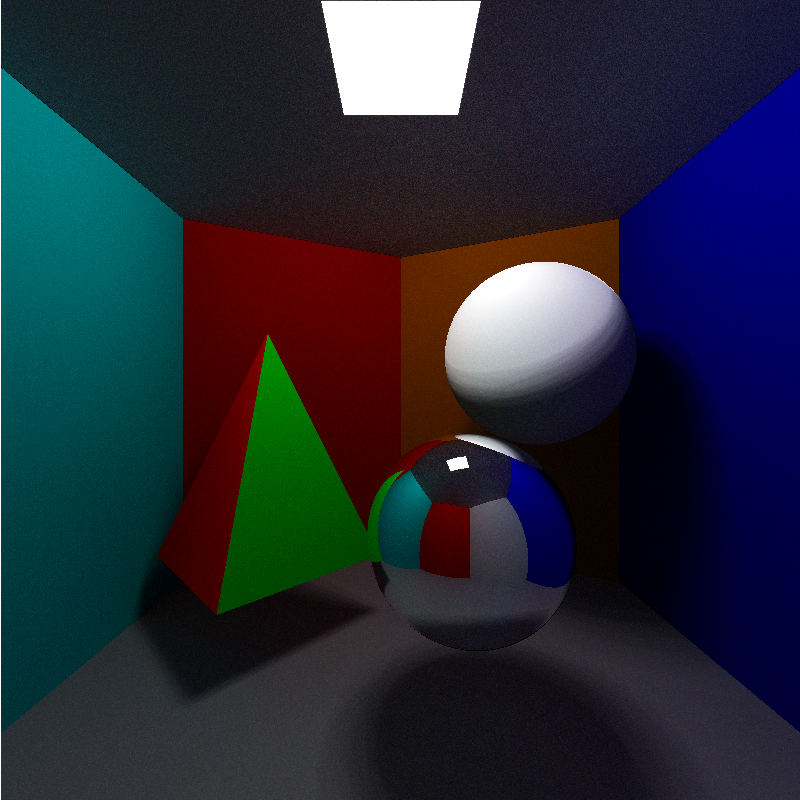

# C++ Ray tracer
This is project implementing a ray tracer from scratch in C++. This project was created as part of the course TNCG15 Advanced Global Illumination and Rendering at Linköping University.

## Sample image
A sample image rendered using 64 samples, 50 light points and max 6 bounces.

## Running
1. Make sure to have glm installed. It can be installed using brew: `$brew install glm`
2. Open the Xcode project file and press run.
